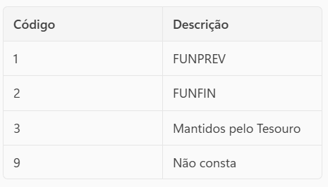
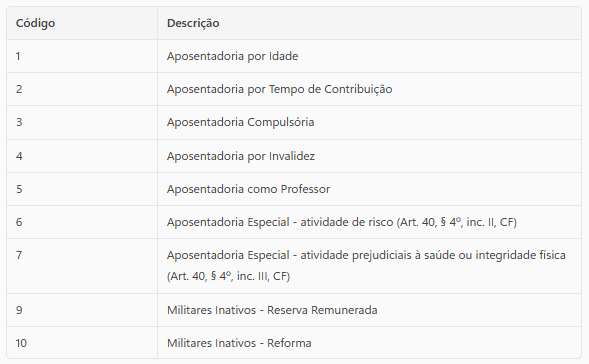

# Projeto Técnico IPREM/DGBC
  Produto: Análise de Fundos Previdenciários (RPPS)

  ## Visão Geral
    - Este projeto realiza a análise técnica e atuarial dos dados cadastrais de servidores ativos e aposentados vinculados ao Regime Próprio de Previdência Social (RPPS) do Município de São Paulo, com base nos critérios legais estabelecidos pelos seguintes normativos:

    - Decreto nº 61.151, de 18 de março de 2022
    Dispõe sobre o custeio do RPPS, a adesão ao Regime de Previdência Complementar (RPC) e a segregação de massas entre os fundos FUNPREV (capitalização) e FUNFIN (repartição simples).


    - Decreto nº 64.144, de 1º de abril de 2025
    Altera o decreto anterior, atualizando critérios de elegibilidade e instituindo contribuições extraordinárias patronais escalonadas ao FUNFIN, com vigência até abril de 2029.

  ## Objetivo
    Os scripts realizam:
    - Classificação do fundo previdenciário (CALCULO_FUNDO) com base em:
      - Data de ingresso no ente (DT_ING_ENTE)
      - Data de nascimento (DT_NASC_SERVIDOR ou DT_NASC_APOSENTADO)
      - Indicador de previdência complementar (IN_PREV_COMP)

    - Verificação de compatibilidade (COMPATIBILIDADE_FUNDO) entre o fundo informado (CO_TIPO_FUNDO) e o fundo calculado.
    - Identificação de duplicidade de CPF (CPF_DUPLICADO) para controle de registros.

    - Geração de relatórios com:

      - Total de registros
      - Compatíveis e incompatíveis (com percentuais)
      - Incompatíveis por fundo e órgão
      - Valor total de contribuições incompatíveis
      - CPFs duplicados

  ## Estrutura do Projeto
  ```
    analise_fundos_rpps/
    ├── dados/                        # Arquivos de entrada (.xlsx)
    │   ├── servidor_2025_10.xlsx
    │   ├── aposentado_2025_10.xlsx
    │   └── pensionista_2025_10.xlsx
    ├── resultados/                   # Arquivos gerados após análise
    │   ├── SERVIDOR_resultado.xlsx
    │   ├── SERVIDOR_resumo_analise.txt
    │   ├── APOSENTADOS_resultado.xlsx
    │   ├── APOSENTADOS_resumo_analise.txt
    │   ├── PENSIONISTAS_incompativeis.xlsx
    │   └── PENSIONISTAS_resumo_analise.txt
    ├── scripts/                      # Scripts de análise
    │   ├── main_fundos_serv.py       # Análise para servidores
    │   ├── main_fundos_apos.py       # Análise para aposentados
    │   └── main_fundos_pens.py       # Análise para pensionistas
    ├── requirements.txt              # Dependências
    └── README.md                     # Documentação técnica
  ``` 

  ## Requisitos Técnicos
    - Python 3.10+
    - Bibliotecas:
      - pandas
      - openpyxl

  ## Instalação:
  ```
    - pip install -r requirements.txt
  ```

  ## Execução

  ### Servidores
    ```
      python scripts/main_fundos_serv.py
    ```
    Busca automaticamente o arquivo com “servidor” no nome na pasta dados/.
    Seleciona o mais recente.
    
    Gera:
      - SERVIDOR_resultado.xlsx
      - SERVIDOR_resumo_analise.txt

  ### Aposentados
    ```
      python scripts/main_fundos_apos.py
    ```
    Busca automaticamente o arquivo com “aposentado” no nome na pasta dados/.
    Seleciona o mais recente.
    
    Gera:
      - APOSENTADOS_resultado.xlsx
      - APOSENTADOS_resumo_analise.txt

  ### Pensionistas
  ```
  python scripts/main_fundos_pens.py
  ```
  Busca automaticamente o arquivo com “pensionista” no nome na pasta dados/.
  Seleciona o mais recente.
    Gera:
      - PENSIONISTAS_incompativeis.xlsx
      - PENSIONISTAS_resumo_analise.txt
      

  ## Campos Gerados
  ### Servidores
    ```
    ID_SERVIDOR_MATRICULA
    ID_SERVIDOR_CPF
    CO_TIPO_FUNDO
    NO_ORGAO
    CO_SITUACAO_FUNCIONAL
    VL_CONTRIBUICAO
    DT_ING_ENTE
    DT_NASC_SERVIDOR
    IN_PREV_COMP
    CPF_DUPLICADO
    CALCULO_FUNDO
    COMPATIBILIDADE_FUNDO
    ```
  ### Aposentados
    ```
    ID_APOSENTADO_MATRICULA
    ID_APOSENTADO_CPF
    CO_TIPO_FUNDO
    NO_ORGAO
    CO_TIPO_APOSENTADORIA (mapeado para descrição)
    VL_APOSENTADORIA
    VL_CONTRIBUICAO
    DT_ING_ENTE
    DT_NASC_APOSENTADO
    IN_PREV_COMP
    CPF_DUPLICADO
    CALCULO_FUNDO
    COMPATIBILIDADE_FUNDO
    ```
  ### Pensionistas
    ```
    ID_INSTITUIDOR_MATRICULA
    ID_INSTITUIDOR_CPF
    NO_ORGAO
    CO_TIPO_FUNDO (FUNPREV ou FUNFIN)
    DT_NASC_INSTITUIDOR
    ID_PENSIONISTA_MATRICULA
    ID_PENSIONISTA_CPF
    VL_CONTRIBUICAO
    CPF_DUPLICADO
    CALCULO_FUNDO
    COMPATIBILIDADE_FUNDO
    ```

  ## Resumos 
  - Cada relatório inclui:

    Total de registros.
    Fundos compatíveis e incompatíveis (com percentuais).
    Incompatíveis por fundo.
    Incompatíveis por órgão (Top 3).
    Valor total de contribuições incompatíveis.
    CPFs duplicados.

  ### Exemplo de Saída – Servidores
    ```
    1. Total de linhas: 116174
    2. CPF_DUPLICADO 
    2.1 - verdadeiro: 15149
    3. Fundos Compatíveis: 112922 (97.20%)
    4. Fundos Incompatíveis: 3252 (2.80%)
    4.1.1 - Incompatíveis no fundo FUNPREV: 3205
    4.1.2 - Incompatíveis no fundo Não consta: 39
    4.1.3 - Incompatíveis no fundo FUNFIN: 8
    5. Incompatíveis por NO_ORGAO:
    5.1 - PREFEITURA DO MUNICIPIO DE SAO PAULO: 3124
    5.2 - HOSP SERV PUBLICO MUNICIPAL: 69
    5.3 - TRIBUNAL DE CONTAS DO MUNICIPIO DE SAO PAULO: 59
    6. Valor total VL_CONTRIBUICAO incompatível: 2415525.97
    ```

   ### Exemplo de Saída – Aposentados
    ```
    1. Total de linhas: 95398
    2. Fundos Compatíveis: 95235 (99.83%)
    3. Fundos Incompatíveis: 163 (0.17%)
    3.1.1 - Incompatíveis no fundo FUNPREV: 141
    3.1.2 - Incompatíveis no fundo FUNFIN: 22
    4. Incompatíveis por NO_ORGAO:
    4.1 - PREFEITURA DO MUNICIPIO DE SAO PAULO: 85
    4.2 - TRIBUNAL DE CONTAS DO MUNICIPIO DE SAO PAULO: 39
    4.3 - SERVICO FUNERARIO DO MUNICIPIO DE SAO PAULO: 37
    5. Valor total VL_CONTRIBUICAO incompatível: 241336.28
    6. CPF_DUPLICADO verdadeiro: 8764
    ```
  ### Exemplo de Saída – Pensionistas
  ```
  1. Total analisados (FUNPREV): 22630
  2. Compatíveis: 22450 (99.21%)
  3. Incompatíveis: 180 (0.79%)
  4. CPF duplicados: 45
  5. Top 5 órgãos com incompatíveis:
  5.1 - PREFEITURA DO MUNICIPIO DE SAO PAULO: 120
  5.2 - TRIBUNAL DE CONTAS DO MUNICIPIO DE SAO PAULO: 30
  5.3 - SERVICO FUNERARIO DO MUNICIPIO DE SAO PAULO: 15
  ```


  ## Lógica de Classificação

    - FUNFIN: ingresso até 27/12/2018, nascimento após 28/02/1957, e não aderiu ao RPC.
    - FUNPREV: ingresso após 27/12/2018, ou nascimento até 28/02/1957, ou aderiu ao RPC.

  ## Lógica aplicada para Pensionistas
  - FUNPREV:
    - Se DT_NASC_INSTITUIDOR ≤ 28/02/1957 → FUNPREV.
    - Se data inválida ou erro → FUNPREV.
  - Caso contrário → Null (registro excluído da análise).

  ## Vocabulários Técnicos
    CO_TIPO_FUNDO

    

    CO_TIPO_APOSENTADORIA

    

  ## Desenvolvedor
    Lucas A. Gouveia
    Diretor Técnico de Dados
    IPREM-SP

  ## Atualização
    Data 17/11/2025